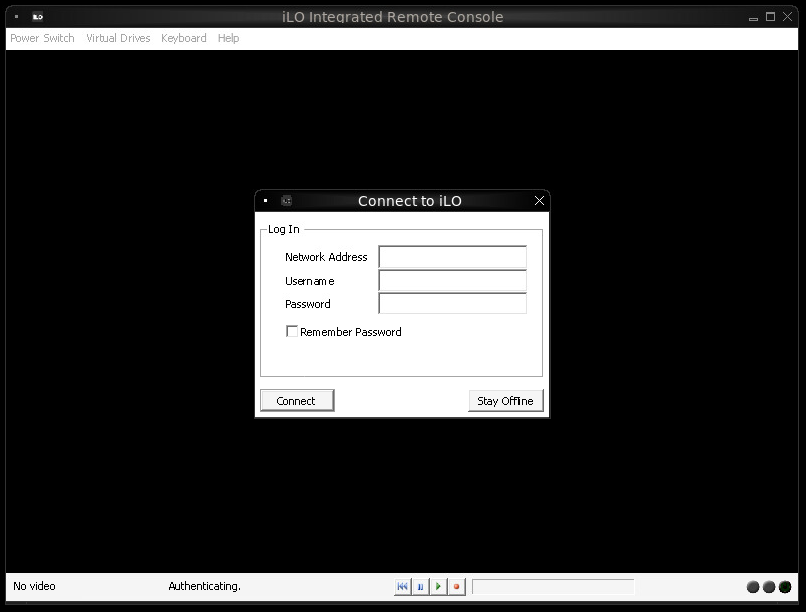

# HPLOCONS in Podman (or Docker)

This repository provides a method for installing
_HPE Lights-Out Standalone Remote Console for Windows (HPLOCONS)_
in a container using Wine.

https://appdb.winehq.org/objectManager.php?sClass=version&iId=41020

## Manual Installation

> **Warning**
> The EULA of _HPLOCONS_ forbids copying and redistribution.

Installation involves manual steps because GUI steps are required.

```shell
# 1. Create an image with Wine
podman build -t localhost/fnndsc/hplocons:wine-base .

# 2. Run HPLOCONS installer inside of a container
podman run -d --name install-hplocons -p 5903:5900 \
    -v "$PWD/supervisord_run_setup.conf:/etc/supervisor/conf.d/supervisord.conf:ro" \
    -v "$PWD/hplocons_installer.sh:/home/hphater/hplocons_installer.sh:ro" \
    localhost/fnndsc/hplocons:wine-base

# connect to the GUI and click through the installation
vncviewer localhost:5903

# save the image
podman stop install-hplocons
podman commit install-hplocons fnndsc/hplocons
podman rm install-hplocons
```

## Usage

Run container using Podman or Docker:

```shell
podman run --rm -p 5900:5900 docker.io/fnndsc/hplocons:latest
```

Now connect to vnc://localhost:5900


